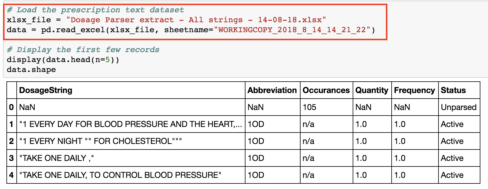

# A.I. Dosage Analyzer
Applying NLP techniques to build a ML model that can learn to detect and predict quantity and frequency from a dosage text.

The model involves using a vectorizer to transform dosage text into machine understandable sparse matrix, which is fed into a LinearSVC model to train it. Once trained, the model has been validated and tested to a 99% precision.
Other enhancements include using eli5 to extract features importance, which makes this an explainable ML project.

## Requirements for running the application
* Latest Python version (try Python 3.7 if facing issues)

## Steps for running the application locally
From the root directory, run the following commands in your terminal:
* $ cd demo/
* $ python app.y
* Now go to your browser and visit http://localhost:8085

## Example API request
If the application is running at http://apsrd8505.uhc.com:8085/, then the request url will look like this sample:

## Requirements for re-training the model
* Anaconda environment manager (comes with Jupyter Notebook): https://www.anaconda.com/download/
* Have experience with using Jupyter Notebook and training/validating ML models

## Steps for re-training the model
Assuming you have setup Anaconda correctly, created a Python 3 environment, and are using that environment. From the root directory, run the following command in your terminal: $ jupyter notebook
* Your browser will open with jupyter notebook running. Navigate to the jupyter notebook files found in this github repository.
* frequency_prediction.ipynb (for training frequency prediction model)
* quantity_prediction.ipynb (for training quantity prediction model)
* Famliarize yourself with the code and change the data source to the data file you wish to train on. 
* Modify the code/data source as necessary to get it to work. The model takes specific column names.

* You just have to run through the entire notebook once in order for it to generate assets in the /pickle folder found in this repository. When you re-run the application, it will automatically pick up on the new trained assets.
