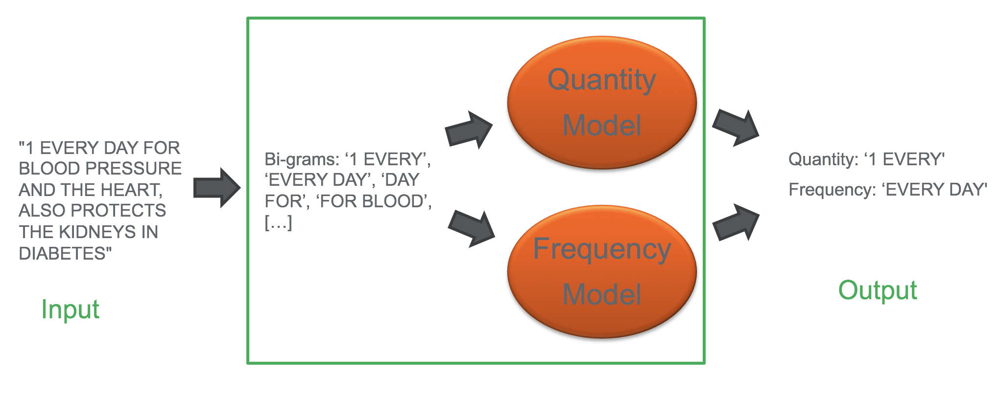
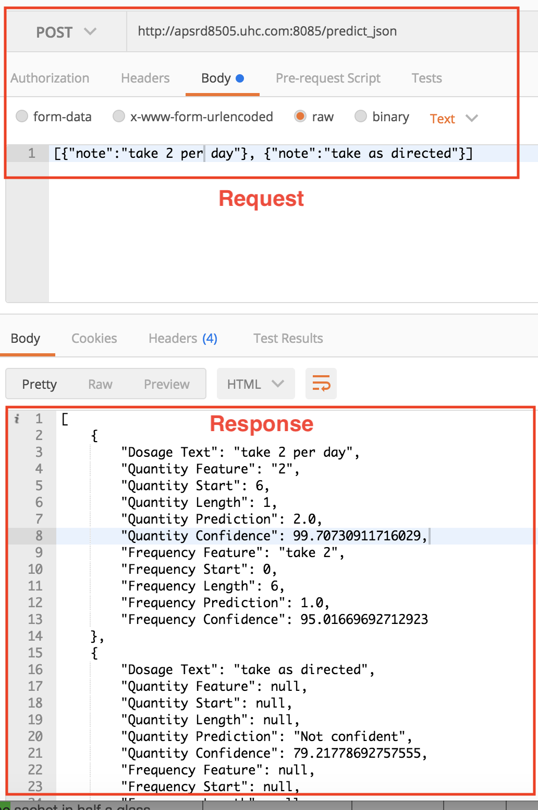

# A.I. Dosage Analyzer
Applying NLP techniques to build a ML model that can learn to detect and predict quantity and frequency from a dosage text.

The model involves using a vectorizer to transform dosage text into machine understandable sparse matrix, which is fed into a LinearSVC model to train it. Once trained, the model has been validated and tested to a 99% precision.
Other enhancements include using eli5 to extract features importance, which makes this an explainable ML project.

## Requirements for running the application
* Latest Python version (try Python 3.7 if facing issues)

## Steps for running the application locally
From the root directory, run the following commands in your terminal:
* $ cd demo/
* $ python app.y
* Now go to your browser and visit http://localhost:8085

## Example API request
If the application is running at http://apsrd8505.uhc.com:8085/, then the request url will look like this sample:

